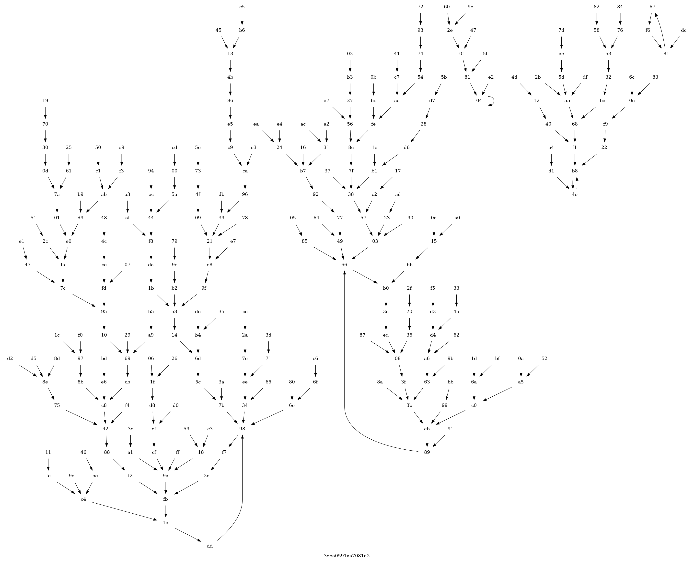

# artemisia
Novel test for randomness based on digraphs.

Imagine a directed graph with 256 nodes and 256 edges, where a single arc points from each node to another node based on the value of a byte. If the graph is determined by 256 random bytes it might looks like this, like plants from the genus artemisia.



Many of the nodes have no incloming arcs (leaves), or indegree=0. Many more have indegree=1, and there are two examples with indegree=4. Unlike plants, the digraph has cycles, including one with length=1. We can characterize the graph by the distribution of indegree values for all its nodes, and posit that graphs determined by randomness will have similar distributions. The principle extends well for graphs with billions of nodes, and serves to test large quantities of data.

With that motivation, here is the help for utility **`artemisia`**

```
Usage: artemisia8, artemisia16, artemisia24, artemisia32, artemisia <n>

Tests random data on stdin by constructing a directed graph with 2^n nodes
and 2^n edges. Each node as outdegree=1 and its target is determined by the
data. For random data, the nodes are observed to have indegree following a
distribution with
    P(indegree = d) = 1 / (e d!)
for 2^n large. Indegree is efficiently counted up to 3 for each node, expecting
    Pe0  = 1 / e        ~ 0.3679
    Pe1  = 1 / e        ~ 0.3679
    Pe2  = 1 / 2e       ~ 0.1839
    Pe3+ = 1 - (5 / 2e) ~ 0.0803
Four different bit lengths n are supported
    n  2^n            data required
    =  ===            =============
    8  256            256 B
    16 65,536         128 KB
    24 16,777,216     48 MB
    32 4,294,967,296  16 GB
Indegree counting is capped at 3 so that only two bits are used for each node,
allowing the 32-bit case to use just 1GB of memory. Once the required data is
read, the count for each expected value is totalled, and the totals compared
with the expected values using Pearsons's Chi Squared test. The p-value is
reported, and a test pass or fail is indicated at the 1% confidence level.
```
